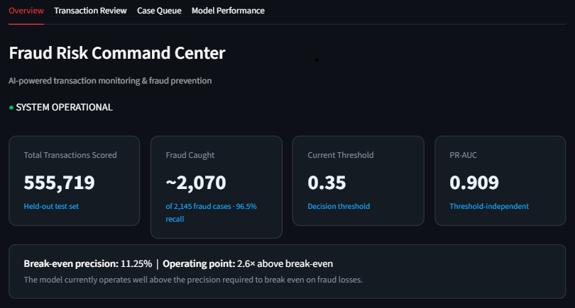
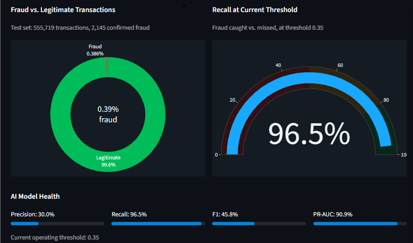
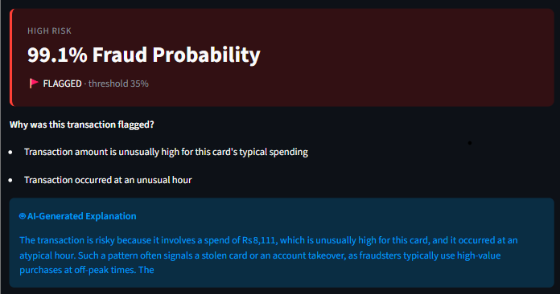
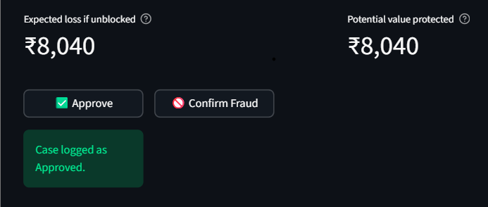
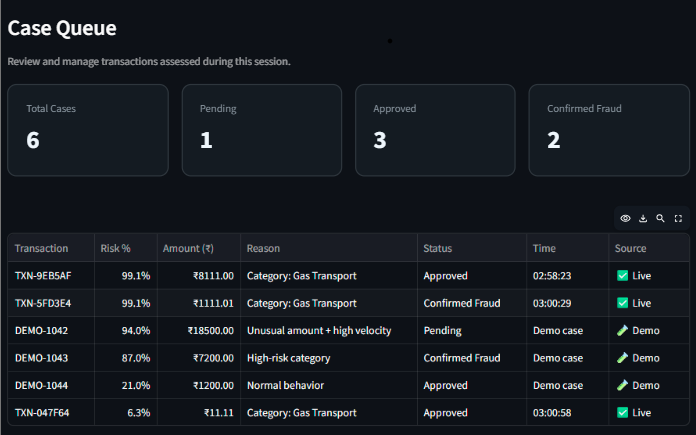
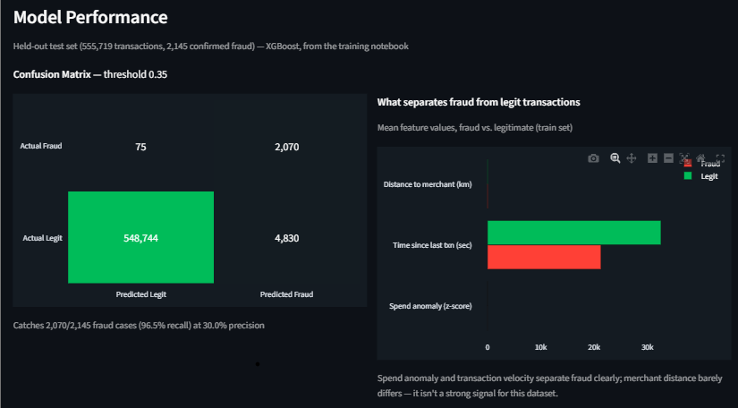
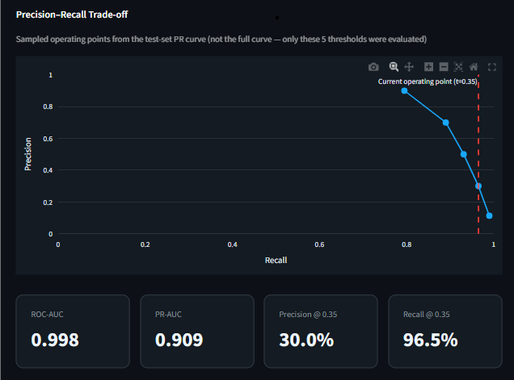

# Fraud Risk Command Center

An AI-assisted fraud detection dashboard built for the Razorpay Buildathon (Track 02 — AI Risk Manager). It scores transactions with a trained XGBoost model, explains each flagged transaction in plain English, and ties every decision back to business economics rather than just a probability score.

## Problem

Fraud models typically output a probability with no explanation. Analysts either trust the score blindly or ignore it, and there is usually no link between the model's statistical performance and whether the model is actually profitable to run.

## Solution

A FastAPI backend serves a trained XGBoost fraud model. A Streamlit dashboard lets an analyst score transactions, see the model's real risk signals for that specific transaction, read an AI-generated plain-language explanation (via Groq), and see the financial impact in rupees. A dedicated Model Performance tab reports the model's real test-set metrics and the break-even precision needed for the model to be worth running.

## Tech Stack

- **Model**: XGBoost, trained on ~1.3M transactions, evaluated on a held-out test set of 555,719 transactions
- **Backend**: FastAPI
- **Frontend**: Streamlit, Plotly
- **AI Explanations**: Groq API (`openai/gpt-oss-20b`), with a deterministic fallback when the LLM is unavailable

## Key Results (held-out test set)

| Metric | Value |
|---|---|
| Transactions evaluated | 555,719 |
| Fraud cases in test set | 2,145 |
| Recall at threshold 0.35 | 96.5% |
| Precision at threshold 0.35 | 30.0% |
| PR-AUC | 0.909 |
| ROC-AUC | 0.998 |
| Break-even precision (business) | 11.25% |
| Operating margin above break-even | 2.6x |

The model catches 2,070 of 2,145 fraud cases at a precision well above the point where fraud detection pays for itself, given the transaction margin assumptions in the training notebook.

## Features

- Real-time transaction scoring with fraud probability and risk bucket (low/medium/high)
- Per-transaction risk signals derived from actual transaction values (amount anomaly, unusual hour, transaction velocity, merchant distance) rather than generic model-wide feature importance
- AI-generated natural-language risk explanations, with a labeled deterministic fallback if the LLM call fails, so scoring never breaks
- Case queue for logging analyst decisions (approve / confirm fraud), with live cases separated from illustrative demo cases
- Model Performance tab: confusion matrix, precision-recall trade-off, and fraud-pattern breakdowns, all computed from the actual training notebook output

## Project Structure

```
fraud_detection/
  app/
    main.py            FastAPI app and /score, /risk-segments, /health endpoints
    model.py            Loads the trained model artifact
    features.py          Feature engineering and per-transaction risk signal generation
    llm.py              AI explanation generation with fallback
    schemas.py            Request/response models
    exceptions.py         Custom exception types
  model_artifacts/
    fraud_model.pkl        Trained XGBoost model, scaler, feature columns, threshold
    category_baselines.json  Per-category historical fraud rate baselines
  streamlit_app.py        Dashboard UI
  fraud_spike.ipynb        Training notebook (EDA, model training, threshold selection)
  requirements.txt
```

## Setup

1. Install dependencies:
   ```
   pip install -r requirements.txt
   ```

2. Add a Groq API key to `.env` in the project root:
   ```
   GROQ_API_KEY=your_key_here
   GROQ_MODEL=openai/gpt-oss-20b
   ```
   The app works without a key; it falls back to a deterministic explanation instead of an AI-generated one.

3. Start the backend:
   ```
   uvicorn app.main:app --reload
   ```

4. In a separate terminal, start the dashboard:
   ```
   streamlit run streamlit_app.py
   ```

## Deployment

> _Placeholder — add the live deployment link here once the app is deployed._
>
> - **Live app**: `TODO — add deployed URL`
> - **API base URL**: `TODO — add deployed API URL`

## Training Notebook

Full EDA, feature engineering, model training, threshold selection, and evaluation:
[Fraud Risk Manager — Colab Notebook](https://colab.research.google.com/drive/1SACDwCHBGXOkxJIN1Exvp-BbcVEtulMm?usp=sharing)

## Known Limitations

- Location fields (`lat`, `long`, `merch_lat`, `merch_long`) are collected and used for the human-facing risk signal, but are not part of the trained model's feature set.
- The "Contributing model features" shown in Transaction Review are the model's global feature importances, not a per-transaction SHAP explanation. The risk signals shown above them are the per-transaction explanation.
- The fraud risk trend chart on the Overview tab is a simulated view for demonstration, built from the real category baseline statistics but not a true time series of live traffic.

## Screenshots

See the `screenshots/` folder.

| # | File | Description |
|---|---|---|
| 1 | `img_1.png` | Overview tab, full page (KPI cards, break-even strip, trend and category charts) |
| 2 | `img_2.png` | Overview tab, fraud split donut and recall gauge |
| 3 | `img_3.png` | Transaction Review, a flagged high-risk transaction with risk signals and AI explanation |
| 4 | `img_4.png` | Transaction Review, financial impact section (expected loss / value protected) |
| 5 | `img_5.png` | Case Queue, with both demo and live cases visible |
| 6 | `img_6.png` | Model Performance, confusion matrix and fraud-vs-legit signal comparison |
| 7 | `img_7.png` | Model Performance, precision-recall trade-off chart |

**1. Overview — KPI cards, break-even strip, trend and category charts**


**2. Overview — fraud split donut and recall gauge**


**3. Transaction Review — flagged high-risk transaction with risk signals and AI explanation**


**4. Transaction Review — financial impact (expected loss / value protected)**


**5. Case Queue — demo and live cases**


**6. Model Performance — confusion matrix and fraud-vs-legit signal comparison**


**7. Model Performance — precision-recall trade-off chart**
